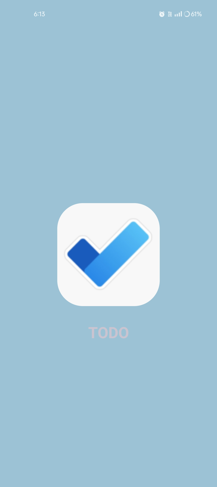
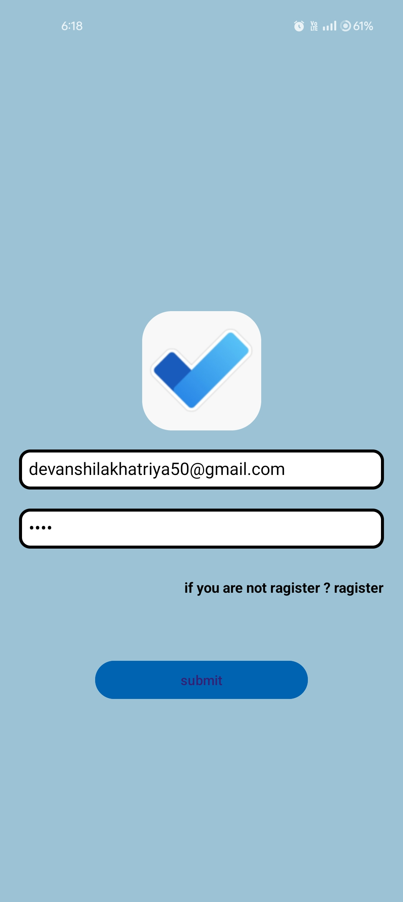

# 📋 Android ToDo App

A simple Android ToDo application developed using **Java** and **Android Studio**. The application helps users organize daily tasks through a clean interface with user authentication and local database storage.

---

## 📱 Features

- User Login
- User Registration
- Splash Screen
- Add New Tasks
- View Task List
- Mark Tasks as Completed
- Delete Tasks
- Local SQLite Database
- RecyclerView for Task Display

---

## 🛠️ Technologies Used

- Java
- Android Studio
- XML
- SQLite
- RecyclerView

---

## 📂 Project Structure

```
activity/
adapter/
model/
```

---

## 🚀 Getting Started

1. Clone the repository.
2. Open the project in Android Studio.
3. Build the Gradle project.
4. Run it on an Android emulator or physical device.

---

## 👩‍💻 Developer

**Devanshi Lakhatriya**

Diploma in Computer Engineering (2026)

Currently learning Shopify Development and Frontend Development.

---

## 📸 Application Screenshots

### Splash Screen


### Login Screen


### Registration Screen


### Home Screen


### Add Task Screen

